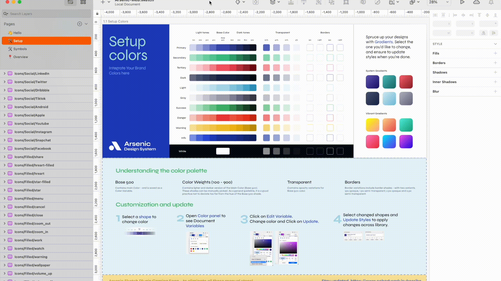
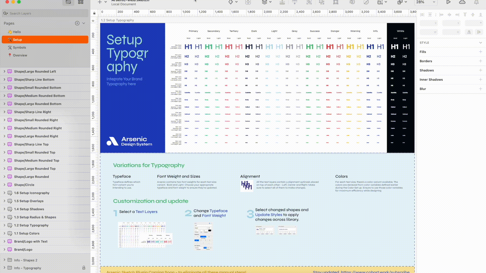

# Arsenic

## Overview

This plugin specially designed and developed for [**Arsenic Design System**](https://www.cohort.work/arsenic-design-system/) for [Sketch app](https://www.sketchapp.com/) to eliminate the manual process of replacing colors and typography along with all the linked components.

*This plugin will not work with any other sketch design files apart from Arsenic Design System.*

## How to Install
[Download latest](https://github.com/cohortwork/Arsenic/releases/latest/download/arsenic.sketchplugin.zip) plugin, unzip it, then double-click the **`arsenic.sketchplugin`**

You can also find all the releases [here](https://github.com/cohortwork/Arsenic/releases).

## Usage
* Open the Arsenic Design System Core Sketch file.

* Press `Option + Command + A` or use the `Plugins` menu and choose **Arsenic**

* Select **Colors** from segment bar:

    1. Select your color variable, 
    2. Change the color, 
    3. Tap Apply.

  

* Select **Typeface** from segment bar:

    1. Select your font-family, 
    2. Select the styles you want to change, 
    3. Tap Apply.

  

* 🎉 Great! And you're done. 

## Contact

[cohort.work](https://www.cohort.work)

<i>Follow us around the web:</i> 
    

## License
The MIT License

See [LICENSE](https://github.com/cohortwork/Arsenic/blob/main/LICENSE) for further details.